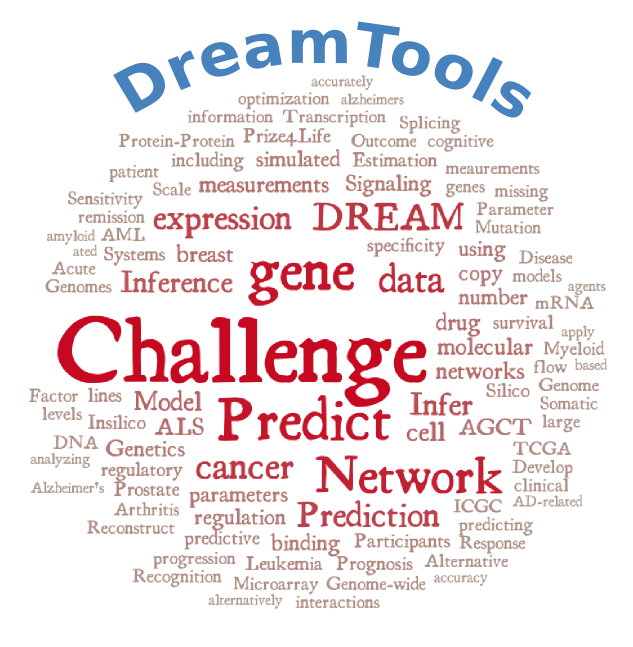

DREAMTools
==========

.. image:: https://badge.fury.io/py/dreamtools.svg
    :target: https://pypi.python.org/pypi/dreamtools

.. image:: https://secure.travis-ci.org/dreamtools/dreamtools.png
    :target: http://travis-ci.org/dreamtools/dreamtools

.. image:: https://coveralls.io/repos/dreamtools/dreamtools/badge.png?branch=master
   :target: https://coveralls.io/r/dreamtools/dreamtools?branch=master

.. image:: https://badge.waffle.io/dreamtools/dreamtools.png?label=issues&title=issues
   :target: https://waffle.io/dreamtools/dreamtools

:Note: DREAMTools is tested for Python 2.7
:Contributions: Please join https://github.com/dreamtools/dreamtools and share your notebooks https://github.com/dreamtools/dreamtools/notebooks

:Online documentation: `On pypi website <http://pythonhosted.org/dreamtools/>`_,
:Issues and bug reports: `On github <https://github.com/dreamtools/dreamtools/issues>`_,

.. contents::

Overview
----------------

**DREAMTools** aims at sharing code used in the scoring of `DREAM <http://dreamchallenges.org>`_ challenges.

The main goals are to provide:

#. scoring functions for the Dream challenges for **end-users** via the **dreamtools-scoring** standalone
   application.
#. a place for **developers** involved in the dream challenges to share code

**DREAMTools** does not provide code related to aggregation,
leaderboards, or more complex analysis even though such code
can be provided (e.g. D8C1 challenge). Note that some functionalities
may be restricted with some access to synapse platform. Indeed,
some challenges will require to download public data sets from `Synapse
<www.synapse.org>`_ (in which case you will need to register).

Installation
---------------

**DREAMTools** depends on a few libraries such as Pandas, Numpy, Matplotlib. They should be automatically
installed with **dreamtools** using pip executable::

    pip install dreamtools

From source, download the source code and install the package with Python::

   git clone git@github.com:dreamtools/dreamtools.git
   cd dreamtools
   sudo python setup.py install

The **dreamtools** executable
------------------------------------------

For users, **DREAMTools** package provides an executable called **dreamtools**, which should be installed automatically. Knowing the name of the challenge (and possibly sub-challenge), it works as  follows::

    dreamtools --challenge d8c1 --sub-challenge sc1a \
        --submission example.zip

It prints some information and the score of the submission for instance for the example above::

     Solution for alphabeta-Network.zip in challenge d8c1 (sub-challenge sc1a) is :
     AUROC: 0.803628919403
     Rank LB: 1

Available challenges
-------------------------

**DREAMTools** includes about 80% of DREAM challenges from DREAM2 to DREAM9.5

Templates
-------------

All template location can be retrieved using **dreamtools** executable::

    dreamtools --challenge d5c2 --download-template

Gold standard
--------------

All gold standard are retrieved automatically. You can obtain a GS location as
follows::

    dreamtools --challenge d5c2 --download-goldstandard

Issues
-----------

Please fill bug report in https://github.com/dreamtools/dreamtools/issues

Contributions
---------------

Please join https://github.com/dreamtools/dreamtools

For developers
----------------

Please see doc/source/developers.rst

Credits
-----------

Please see doc/source/credits.rst

More documentation ?
------------------------

Please see the doc directory, which is processed and posted on 
`pypi website <http://pythonhosted.org/dreamtools/>`_ with each release.

