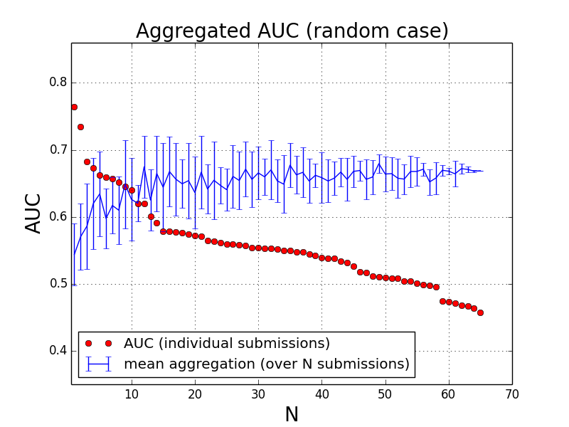

Overview
===========

This directory contains tools for users and administrators of the Dream8-HPN challenge (alias D8C1).

There were 4 sub-challenges called 

* SC1A for Network
* SC1B for Network Insilico
* SC2A for Prediction
* SC2B for Prediction Insilico

For users, the most relevant is the **scoring** module that provides tools to compute the AUROC and RMSE.

Other modules required adming right on synapse projects are are therefore irrelevant or end-users for now.

scoring
-----------

The scoring functions inside **scoring** can be used to obtain the ROC or RMSE
values of a given submissions.

Format of submissions are explained on https://www.synapse.org/#!Synapse:syn1720047/wiki/

ROC and RMSE are absolute values and you may get a **better** score than what
was obtained in the challenges:

- https://www.synapse.org/#!Synapse:syn1720047/wiki/60530
- https://www.synapse.org/#!Synapse:syn1720047/wiki/60532

Note however, the teams were also compared to each other and final ranking could
be different from the pure ROC/RMSE ranking.

Here is the procedure to get the ROC or RMSE::

    from dreamtools.dream8.D8C1 import scoring

    sc1a = scoring.HPNScoringNetwork(sc1a_submissions.zip)
    sc1a.compute_all_aucs()
    sc1a.get_auc_final_scoring()

    sc1b = scoring.HPNScoringNetworkInsilico(sc1b_submissions.zip)
    sc1b.compute_score()
    sc1b.auc

    sc2a = scoring.HPNScoringPrediction(sc2a_submissions.zip)
    sc2a.compute_all_rmse()
    sc2a.get_mean_rmse()

    sc2b = scoring.HPNScoringPredictionInsilico(sc2b_submissions.zip)
    sc2b.compute_all_rmse()
    sc2b.get_mean_rmse()

downloads.py 
----------------

Download all valid submissions that were used to score and rank the participants
in Dream8-HPN challenge. This could be required to 

#. create the aggregation figures
#. compute the final ranking table used in the final leaderboards

::

    from dreamtools.dream8.D8C1 import downloads
    d = downloads.SubmissionsDownloader()
    d.download_all() # takes some time

aggregation
-------------

The SC1A challenge is very slow to compute. Others are faster. You can plot the aggregation of N best participants
of random set of participants. We'll show here below the SC1B case but all cases have the same API.

:: 

    from dreamtools.dream8.D8C1 import aggregation
    a = aggregation.SC1B_aggregation()
    
    # Best aggregation
    a.plot_aggr_best_score()
    
    # Random aggregation
    a.plot_aggr_random(10, 20) # first argumentss the number of replicates, second number of participants to use

    
.. figure:: sc1a_aggregation.png
    

    
