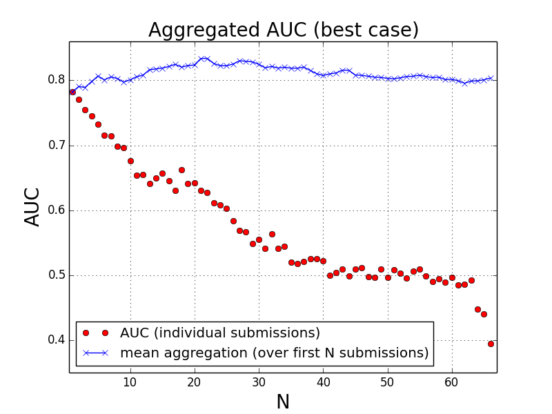

Overview
===========

:Title: DREAM 8 - HPN-DREAM Breast Cancer Network Inference Challenge
:Nickname: D8C1
:Summary: Participants in this Challenge were provided with extensive proteomics time-course dataset on four breast cancer cell lines and tasked with analyzing these data to solve several sub-challenges.
:Challenge: HPN-DREAM Breast Cancer Network Inference Challenge
:SubChallenges: SC1A, SC1B, SC2A, SC2B
:Synapse page: https://www.synapse.org/#!Synapse:syn1720047

.. contents::

This directory contains tools for users and administrators of the Dream8-HPN challenge (alias D8C1).

There were 4 sub-challenges called

* SC1A for Network
* SC1B for Network Insilico
* SC2A for Prediction
* SC2B for Prediction Insilico

For users, the most relevant are the **scoring** and **ranking** modules that provides
tools to compute the AUROC and RMSE as well as the ranking that would have been obtained as comparead with other
participants.

Most of the other modules would require admin access to the synapse project. Amongst those other modules,
some are up-to-date (E.g., those to create the aggregate results), some are just kept for book keepig (e.g, hpn,
sc1a_tools).

.. seealso:: dreamtools on bitbucket (https://bitbucket.org/cokelaer/dreamtools) was developed for dream8 HPN challenge
    and most of its contensts has been moved here.

Before starting
------------------

If you are a end-user, you can skip this section and move directly to the scoring section.

For admin, you may need to download some files before using the code e.g., the
aggregation functions. Since you will need to access to synapse to download
those files, you will also need to create a configuration file in your home directory.::

    [authentication]
    username: your_email_registered@synapse
    password: yourSynapsePassword

Then, type::

    from dreamtools.dream8.D8C1 import downloads
    d = downloads.GSDownloader()
    d.download_experimental()

    d = downloads.SubmissionDownloader()
    d.download_all()

Scoring
-----------

The scoring functions inside **scoring** can be used to obtain the ROC or RMSE
values of a given submissions.

The **ranking** can be used to obtain the rank of a submisson as compared to all other participants.

Format of submissions are explained on https://www.synapse.org/#!Synapse:syn1720047/wiki/
and examples are provided in ./templates directory.

ROC and RMSE are absolute values and you may get a **better** score than what
was obtained in the challenges:

- https://www.synapse.org/#!Synapse:syn1720047/wiki/60530
- https://www.synapse.org/#!Synapse:syn1720047/wiki/60532

However, the teams were also compared to each other and final ranking could
be different from the pure ROC/RMSE ranking. The final ranking is the average
rank for each combination of cell line/stimuli in SC1A for instance.

Here is the procedure to get the ROC or RMSE for each sub-challenge::

    from dreamtools.dream8.D8C1 import scoring

    sc1a = scoring.HPNScoringNetwork(sc1a_submissions.zip)
    sc1a.compute_all_aucs()
    sc1a.get_auc_final_scoring()

    sc1b = scoring.HPNScoringNetworkInsilico(sc1b_submissions.zip)
    sc1b.compute_score()
    sc1b.auc

    sc2a = scoring.HPNScoringPrediction(sc2a_submissions.zip)
    sc2a.compute_all_rmse()
    sc2a.get_mean_rmse()

    sc2b = scoring.HPNScoringPredictionInsilico(sc2b_submissions.zip)
    sc2b.compute_all_rmse()
    sc2b.get_mean_rmse()

:Note: scoring in SC2B is identical to the official learderboard shown in
    https://www.synapse.org/#!Synapse:syn1720047/wiki/60532 . However, the gold
    standard used in the official leaderboard was incorrectly computed. We also provide the
    new version in the code. See **HPNScoringPredictionInsilico** class in the **scoring** module.

    A scaling/normalization for each species over all conditions and time points was computed to
    take into account the fact that simulated phophoactivity spawn across different orders
    of magnitude. Initially, the same 20 conditions were used for both SC1B and SC2B, so the
    scaling factor was the same. Unfortunately, at some point, three inhibitors (Pertuzumab,
    U0126 and Cetuximab) were removed from the SC2B simulations. The result was that different
    scaling factors where used to generate the training data and the gold standard data. To correct
    this, the GS data was recomputed with the same scaling factor as used in SC1B.

Ranking
-----------

Here is the procedure to get the final ranking::

    from dreamtools.dream8.D8C1 import ranking

    r = ranking.SC1A_ranking()
    r.append_submissions(sc1a_submissions.zip)
    r.get_rank_your_submissions()

    # similarly for SC1B, SC2A, SC2B

Standalone
--------------

In a shell, type one of ::

    dreamtools-scoring --challenge d8c1 --sub-challenge sc1a --filename templates/alphabeta-Network.zip
    dreamtools-scoring --challenge d8c1 --sub-challenge sc1b --filename templates/alphabeta-Network-Insilico.zip
    dreamtools-scoring --challenge d8c1 --sub-challenge sc2a --filename templates/alphabeta-Prediction.zip
    dreamtools-scoring --challenge d8c1 --sub-challenge sc2b --filename templates/alphabeta-Prediction-Insilico.zip

downloads.py module
-------------------------

Download all valid submissions that were used to score and rank the participants
in Dream8-HPN challenge. This could be required to

#. create the aggregation figures
#. compute the final ranking table used in the final leaderboards

::

    from dreamtools.dream8.D8C1 import downloads
    d = downloads.SubmissionsDownloader()
    d.download_all() # takes some time

Templates
-------------

Templates can be found in the ./templates directory for each of the 4 sub-challenges.

aggregation module
-------------------------

The SC1A challenge is very slow to compute. Others are faster. You can plot the aggregation of N best participants
of random set of participants. We'll show here below the SC1B case but all cases have the same API.

::

    from dreamtools.dream8.D8C1 import aggregation
    a = aggregation.SC1B_aggregation()
    a.load_submissions()
    # a.remove_correlated_submissions()

    # Best aggregation
    a.plot_aggr_best_score()

    # Random aggregation
    a.plot_aggr_random(10, 20) # first argumentss the number of replicates, second number of participants to use

aggregation standalone
---------------------------

It is implemented for SC1B and SC2B and works by providing a directory that contains the list of zipped files to be used
for the aggregation:

::

    from dreamtools.dream8.D8C1 import aggregation
    sc1b = aggregation.SC1B_aggregation(local_submissions='where to find the zip files')
    sc1b.plot_aggr_best_score(20)  # uses the first best 20 submissions. put large number to use everything

    sc2b = aggregation.SC2B_aggregation(local_submissions='where to find the zip files')
    sc2b.plot_aggr_best_score(20)  # uses the first best 20 submissions. put large number to use everything

Create EDA files for an aggregation
-------------------------------------

::

    a = aggregation.SC1A_aggregation()
    a.remove_correlated_submissions()
    aggr = a.aggregate_submissions(66)
    aggr.compute_score()
    a.compute_grand_mean_auc(aggr.auc)
    aggr.edge_score_to_eda_files('test')

others
-------

#. commons.py
#. hpn.py  was used to create the leaderboards and updating scores in synapse (admin only)
#. sc1a_tools.py  used to computea null distribution (admin only)
#. setup.py used to build a cython code to compute the scores (SC1A)
#. submissions.py retrieve submissions (admin only)

testing
---------

There is a test suite in ./test/dream8/D8C1 It contains test for the scoring and test for the other modules (admin only)
